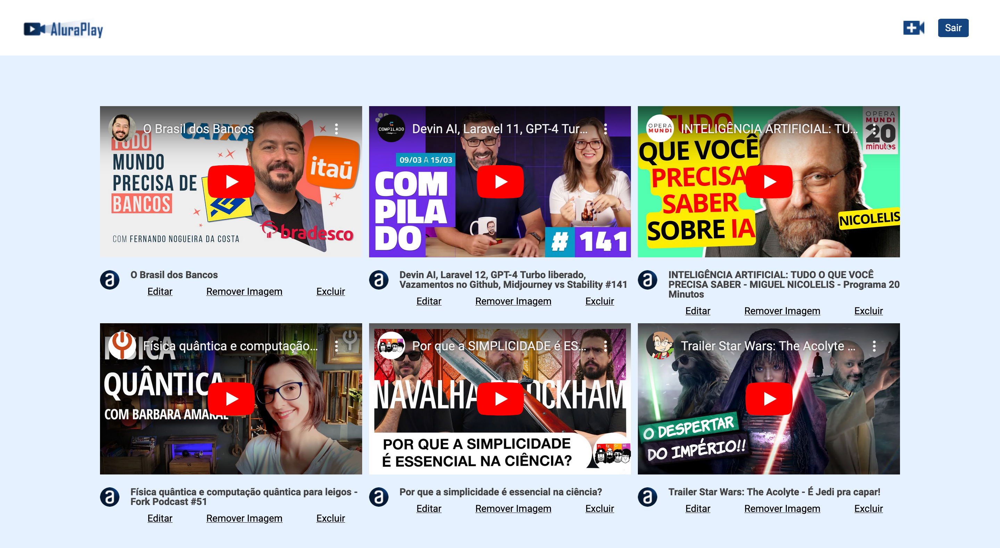

# Final Project: PHP on the Web - Security and APIs

[](https://php.net/)
[
](https://getcomposer.org/)

## Description

This project is the result of the PHP training at [Alura](https://alura.com.br/), where topics related to language security and functionality were covered. The project includes the implementation of sessions for login, secure password handling, file uploads with security measures, and the use of APIs for accessing new routes and searching for videos in JSON format.

## Features

- Login system with sessions
- Secure password handling
- File uploads with security measures
- Use of APIs for accessing new routes and searching for videos in JSON format

## How to Run

> **Warning:** This application is designed for learning purposes. Therefore, some features are not completely finished. The [database](database) folder contains some "helper" files that are designed to test certain features and facilitate others.

1. Clone the repository
2. [Set `.env`](#set-env)
3. [Prepare Database](#prepare-database)
2. Set up a local PHP server or use a hosting service
4. [Create a User](#creating-a-user)
5. Run the application and access the login functionality by trying to edit or create some video

### Set `.env`

Run

```bash
cp .env.example .env
```
Then edit the created file

### Prepare Database

Create database:
```bash
php database/create-db.php
```

Seeding:
```bash
php database/seed-videos.php
```

### Creating a User

To create a user, you can run:
```bash
php database/insert-users.php your_email your_password
```

Replace `your_email` with your user email and `your_password` with your user password.

## Contribution

Feel free to contribute with suggestions, improvements, or fixes. Just fork the repository, implement the changes, and send a pull request.

## License

This project is licensed under the MIT License - see the [LICENSE](LICENSE) file for more details.

## Demo

